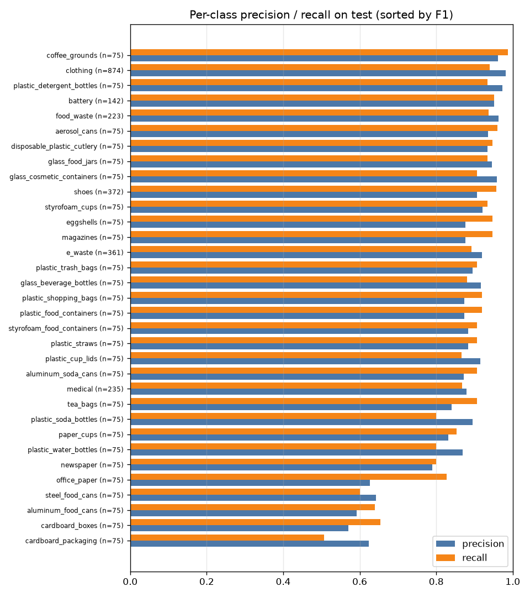
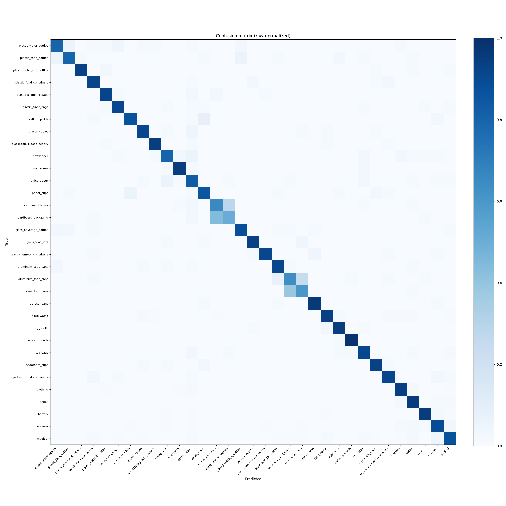
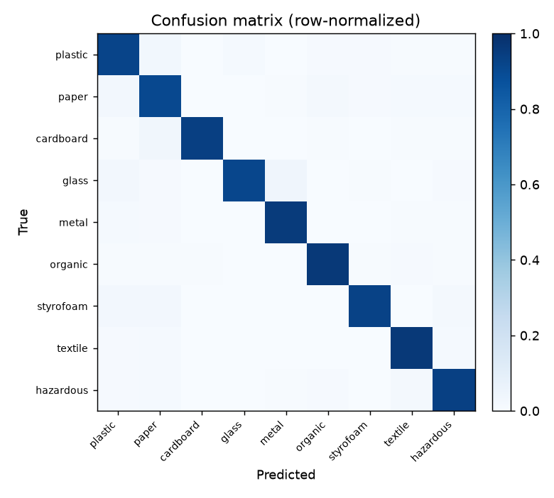
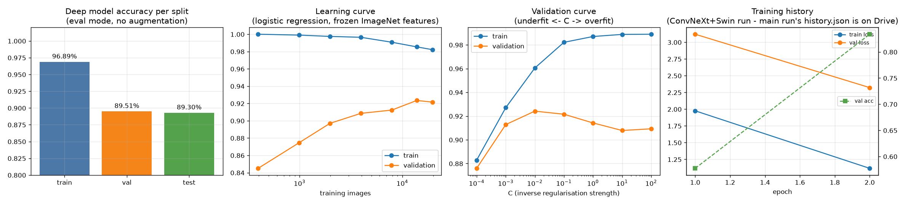
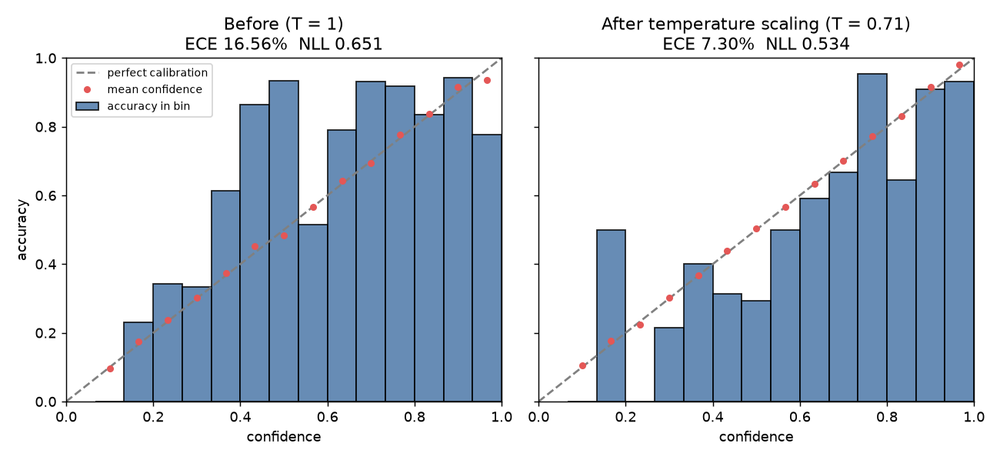
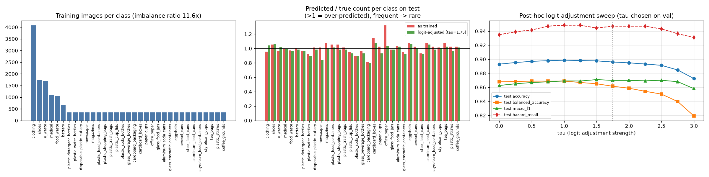
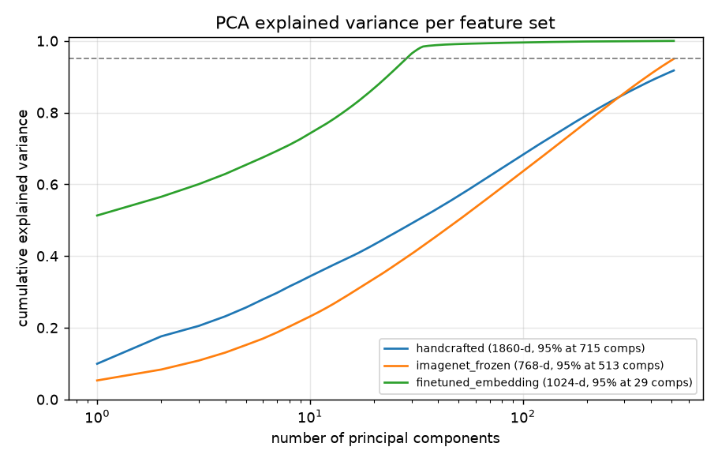
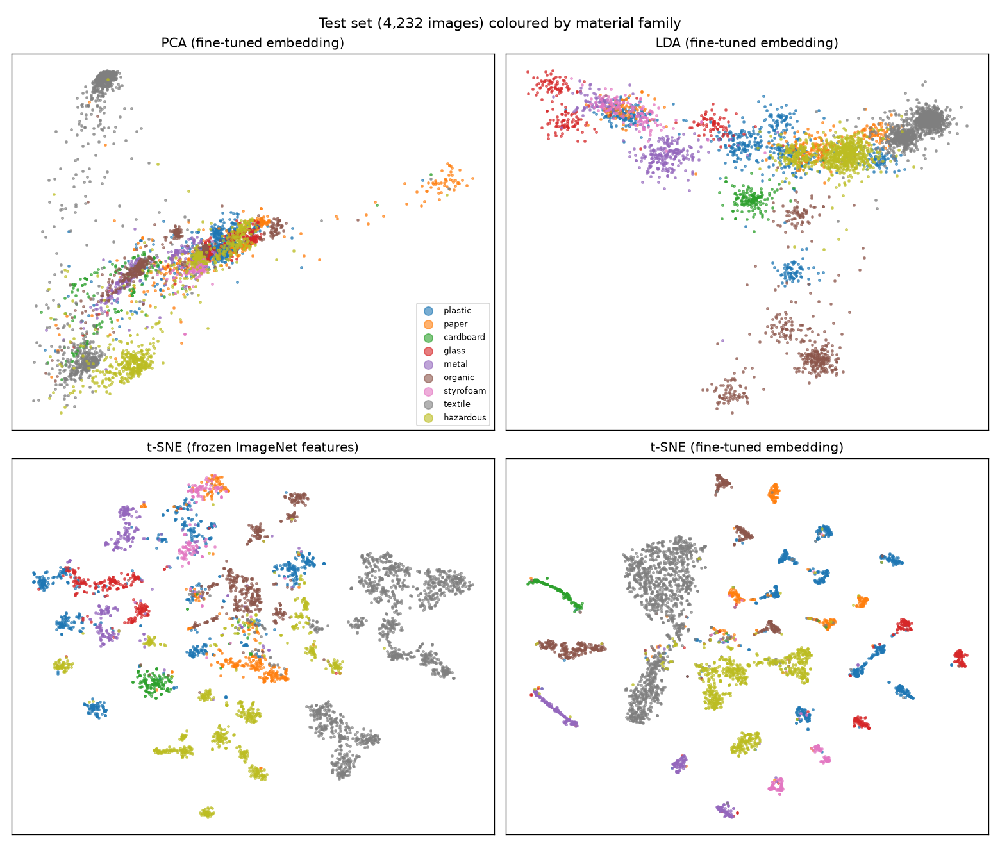
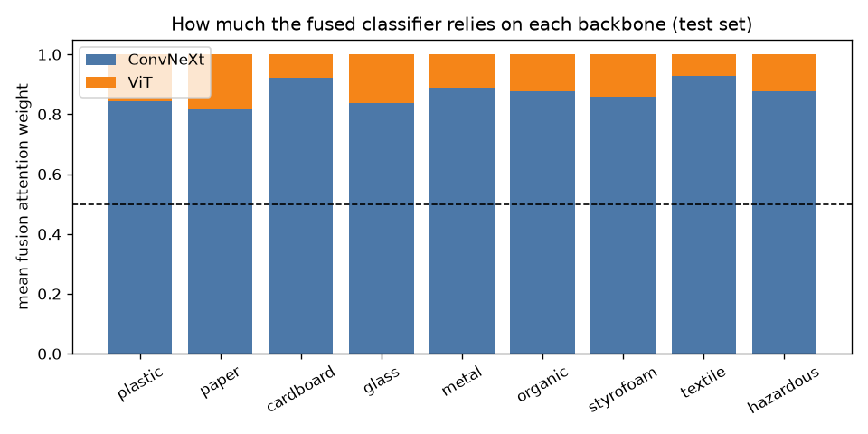

<!-- readme.md - the single universal reference for the project: data, model, training, every result, analysis, how to run, changelog -->

# edge-waste — CAPS-FCL waste classification

An edge-deployable waste-sorting system: a camera finds each item, a
ConvNeXt + Vision-Transformer hybrid identifies it (33 item classes in 9
material families, including hazardous batteries, e-waste and medical waste),
moisture/gas sensors score organic contamination, and a decision engine routes
the item to a bin — with calibrated uncertainty, a statistically bounded
hazard-leakage rate, explanations, and federated learning across units.

> **This readme is the one document to read.** It is updated with every
> change to the project (see the [changelog](#changelog)). Every number in it
> comes from a logged run in this repository; commands to regenerate each one
> are in [Reproducibility](#reproducibility).

**Status (TRL 3, experimental proof of concept).** All software is built and
evaluated on real held-out data. Physical sensors, the diverter actuator and
Raspberry Pi deployment do not exist yet — sensors are simulated and the
contamination model is fitted on synthetic calibration data (clearly marked
wherever it appears).

## Headline results (held-out test set, 4,232 images never used in training or model selection)

| Metric | Result | 95% bootstrap CI |
|---|---|---|
| Item accuracy (33 classes) | **89.30%** | 88.42 – 90.19% |
| Family / routing accuracy (9 bins) | **94.14%** | 93.43 – 94.80% |
| Hazardous-item recall | **93.50%** (690/738) | 91.63 – 95.13% |
| Macro F1 | 0.863 | 0.850 – 0.874 |
| Top-3 accuracy | 96.74% | |
| Macro ROC-AUC (one-vs-rest) | 0.981 | |
| Detector mAP50 (1-class / 18-class TACO) | 0.700 / 0.383 | |

These are the reported ConvNeXt + ViT hybrid. The analysis below found that an
RBF SVM on *frozen* ImageNet ConvNeXt features does better — **93.3% item,
97.1% family, 98.1% hazard recall** (McNemar p ≈ 8e-21) — which exposed a
fine-tuning problem with a prepared fix; see
[Improving the classifier](#improving-the-classifier).

## Contents

1. [Folder structure](#folder-structure)
2. [Quick start](#quick-start)
3. [Data](#data)
4. [Model architecture](#model-architecture)
5. [Training setup](#training-setup)
6. [Results](#results)
7. [Overfitting and underfitting](#overfitting-and-underfitting)
8. [Calibration](#calibration)
9. [Class imbalance](#class-imbalance)
10. [Classical ML baselines: PCA, LDA, SVM, kNN, logistic regression, random forest, naive Bayes](#classical-ml-baselines)
11. [What the model learned: embeddings and backbone attention](#what-the-model-learned)
12. [Improving the classifier (findings and the next training run)](#improving-the-classifier)
13. [Uncertainty and risk-bounded hazard routing](#uncertainty-and-risk-bounded-hazard-routing)
14. [Object detection](#object-detection)
15. [Contamination index (sensor fusion)](#contamination-index-oci)
16. [Decision engine](#decision-engine)
17. [Explainability, segmentation, augmentation, federated learning, video, deployment](#other-components)
18. [Model cost](#model-cost)
19. [Reproducibility](#reproducibility)
20. [Limitations](#limitations)
21. [Review FAQ](#review-faq)
22. [Changelog](#changelog)

## Folder structure

```
edge-waste/
├── readme.md                         this document
├── project_status.md                 dated session log and open risks
├── pyproject.toml, requirements.txt  package + dependencies (edgewaste-* commands)
├── configs/                          classifier_convnext_vit.yaml (main), classifier_convnext_swin.yaml,
│                                     classifier_professor_dataset.yaml, detector_yolo_taco.yaml
├── notebooks/                        colab_classifier_training.ipynb (GPU training on Colab)
├── scripts/                          launchers, demos, analysis drivers, detector training helpers
├── reports/ml_analysis/              generated analysis: summary.json, CSV tables, figures/
├── src/edgewaste/
│   ├── config.py, taxonomy.py, common_utils.py
│   ├── data/                         download, ingest, split, load images
│   ├── classification/               hybrid model, train, evaluate, inference, onnx export
│   ├── detection/                    yolo detector, coco object recogniser, sam segmentation
│   ├── decision_engine/              identity prior, mc-dropout, conformal routing, routing rules
│   ├── contamination/                oci normalisation, models, simulated sensors, shap
│   ├── explainability/               grad-cam, lime
│   ├── augmentation/                 dcgan synthetic images
│   ├── federated/                    fedavg simulation
│   ├── analysis/                     metrics, fit diagnostics, calibration, imbalance, baselines, cost
│   └── applications/                 live camera pipeline, video litter survey
├── docs/planning/                    original plans and stage checklists (historical)
├── docs/faculty_reviews/             review submissions (not in git)
├── docs/patent_drafts/               invention disclosure drafts (not in git — pre-filing)
├── weights/                          base yolo26n / mobile sam weights (not in git)
└── data/, runs/                      datasets, checkpoints, caches (not in git)
```

Every source, config and doc file starts with a one-line lowercase comment
stating what it is.

## Quick start

```bash
pip install -e ".[data,detect,explain,export]"   # CUDA torch first if you have a GPU

python -m edgewaste.taxonomy                      # the 33 classes and where each comes from
edgewaste-fetch  --config configs/classifier_convnext_vit.yaml   # Kaggle token needed
edgewaste-ingest --config configs/classifier_convnext_vit.yaml
edgewaste-split  --config configs/classifier_convnext_vit.yaml
edgewaste-train  --config configs/classifier_convnext_vit.yaml   # or notebooks/ on Colab
edgewaste-eval   --config configs/classifier_convnext_vit.yaml --ckpt runs/stage1/best.pt \
                 --manifest data/splits_colab_reconstructed.csv

python scripts/run_live_camera.py                 # live detect -> classify -> route demo
edgewaste-video --source clip.mp4 --det-ckpt <detector best.pt> --cls-ckpt runs/stage1/best.pt
```

## Data

### Sources

| Source (Kaggle) | Used for | Images |
|---|---|---|
| Recyclable and Household Waste Classification (`alistairking/...`) | 30 item classes, studio + real-world photos | 15,000 |
| Garbage Classification 12 (`mostafaabla/garbage-classification`) | battery, clothing, shoes, extra food waste | |
| TrashBox (`minhle13/trashbox`) | e-waste, medical — the hazardous classes no other source has | |

Coarse folders that cannot be mapped to one fine-grained class (e.g. a generic
"plastic" folder) are deliberately dropped rather than guessed. Unreadable
images are rejected at ingest (one corrupt TrashBox e-waste JPEG).

### Taxonomy: 33 item classes in 9 material families

The classifier predicts the **item**; the **family** (= physical bin) is
derived from it. Numbers are training images / test F1.

| Family | Items |
|---|---|
| plastic (4,500) | water bottles 350/0.83, soda bottles 350/0.85, detergent bottles 350/0.95, food containers 350/0.90, shopping bags 350/0.90, trash bags 350/0.90, cup lids 350/0.89, straws 350/0.89, cutlery 350/0.94 |
| paper (2,000) | newspaper 350/0.79, magazines 350/0.91, office paper 350/0.71, paper cups 350/0.84 |
| cardboard (1,000) | boxes 350/0.61, packaging 350/0.56 |
| glass (1,500) | beverage bottles 350/0.90, food jars 350/0.94, cosmetic containers 350/0.93 |
| metal (2,000) | aluminium soda cans 350/0.89, aluminium food cans 350/0.62, steel food cans 350/0.62, aerosol cans 350/0.95 |
| organic (2,985) | food waste 1,039/0.95, eggshells 350/0.91, coffee grounds 350/0.97, tea bags 350/0.87 |
| styrofoam (1,000) | cups 350/0.93, food containers 350/0.89 |
| textile (8,302) | clothing 4,077/0.96, shoes 1,733/0.93 |
| **hazardous** (4,916) | battery 661/0.95, e-waste 1,684/0.91, medical 1,095/0.87 |

Why a hierarchy: a sorting facility acts on the family, so family accuracy is
the operational metric, and item-level errors inside one family (aluminium vs
steel food cans) are recognition errors with no routing consequence. Hazardous
items are separated at the taxonomy level so their recall is never averaged
away.

### Splits and leakage prevention

- **Stratified 70 / 15 / 15** per class, seed 42: **19,739 train / 4,232 val /
  4,232 test** (28,203 manifest rows including the one corrupt image, which the
  loader skips).
- **Validation** is used for early stopping and every hyperparameter or
  threshold choice; **test** is scored once per model.
- **Duplicate-safe file names:** each processed image is named by a hash of
  its source path, so the same file never appears twice.
- **A leakage bug was found and fixed.** The hash was originally taken over
  the OS-specific path string, so Windows and Colab produced different names,
  different sort orders and therefore different splits: re-scoring the
  Colab-trained checkpoint on a locally rebuilt split gave an inflated 94.52%
  because ~70% of its "test" images had been training images. It was caught
  because the number went *up*. Hashing now uses the POSIX path relative to
  the source root.
- **The exact Colab split was recovered** (`scripts/reconstruct_colab_split.py`)
  by recomputing the old Colab-side names and re-adding the one corrupt image
  that Colab's split had counted. Verified: the checkpoint scores exactly
  3,779/4,232 = 89.30%, 94.14% family and 690/738 hazard recall on it — all
  three Colab-reported numbers. Every analysis below uses this split.

### Preprocessing and augmentation

- Resize to 224x224, ImageNet mean/std normalisation (matches backbone pretraining).
- Training-only augmentation: resize to 256 then RandomResizedCrop 224 (scale
  0.7–1.0), horizontal flip, rotation ±20°, colour jitter (brightness /
  contrast / saturation 0.2), Gaussian blur (p = 0.2), random erasing (p = 0.1)
  — simulating camera pose, lighting and partial occlusion on a conveyor.
- Synthetic images for rare classes are available via a per-class DCGAN
  ([augmentation](#other-components)); not used in the reported model.

## Model architecture

```
image 224x224x3
   ├── ConvNeXt-Tiny (CNN)  -> global avg pool 768-d -> Linear -> LayerNorm -> GELU -> 512-d  f_cnx
   └── ViT-Small/16 (transformer) -> avg pool 384-d  -> Linear -> LayerNorm -> GELU -> 512-d  f_vit
attention fusion:  score_s = W2·GELU(W1·f_s + b1) + b2      alpha = softmax(score_cnx, score_vit)
                   fused   = [alpha_cnx·f_cnx , alpha_vit·f_vit]                            1024-d
head:              Dropout 0.2 -> Linear 1024->512 -> GELU -> Dropout 0.2 -> Linear 512->33
output:            softmax over 33 items; family probability = sum over the family's items
```

- **Why two backbones.** A CNN's local, translation-equivariant bias suits
  surface texture (foil crinkle, cardboard fibre); a ViT attends globally from
  the first layer and suits shape and context. The learned attention decides
  per image how much of each to use — and [measurably](#what-the-model-learned)
  leans on ConvNeXt.
- **Transfer learning.** ConvNeXt-Tiny pretrained on ImageNet-12k then 1k
  (`convnext_tiny.in12k_ft_in1k`); ViT-S/16 AugReg ImageNet-21k then 1k
  (`vit_small_patch16_224.augreg_in21k_ft_in1k`). All layers are fine-tuned.
  Training from scratch was tried once and collapsed to 49% accuracy.
- **Activation functions.** GELU in every hidden layer (both backbones, both
  projections, the fusion scorer, the head); softmax for the fusion weights and
  the output. GELU is what both pretrained backbones use, is smooth, and has no
  dead-neuron problem.
- **Normalisation.** LayerNorm, not BatchNorm — independent of batch
  statistics, so it behaves the same at training batch 32 and edge batch 1.
- **Regularisation in the model.** Two dropout layers (p = 0.2) in the head;
  no stochastic depth.
- **Swin variant.** `configs/classifier_convnext_swin.yaml` swaps the ViT for
  Swin-Tiny (backbone-agnostic code); see [Improving the classifier](#improving-the-classifier).

## Training setup

This is exactly how the reported 89.30% checkpoint (`runs/stage1/best.pt`) was
trained. The main config now holds an improved recipe for the next run — see
[Improving the classifier](#improving-the-classifier).

| Setting | Value | Reason |
|---|---|---|
| Optimiser | **AdamW**, β2 = 0.999, ε = 1e-8, β1 cycled 0.95 → 0.85 → 0.95 by the schedule | per-parameter adaptive steps for two pretrained backbones plus a new head; decoupled weight decay regularises correctly under Adam |
| Learning rate | peak **3e-4**, same for all layers | |
| Schedule | **OneCycle**: cosine warm-up from 1.2e-5 over the first epoch, cosine decay to ~1e-9, stepped every batch | warm-up protects pretrained weights; annealing settles into a flat minimum |
| Weight decay | 0.05 | |
| Loss | cross-entropy, **label smoothing 0.1** | stops over-confident logits between near-duplicate classes |
| Imbalance handling | balanced sampler **and** inverse-frequency loss weights | found to over-correct — see [Class imbalance](#class-imbalance) |
| Batch size / epochs | 32 / 15, early-stopping patience 5 on val accuracy | best epoch was 15 (the last) |
| Precision / clipping | fp16 mixed precision with GradScaler; gradient L2 norm clipped at 1.0 | |
| Seed | 42 | |
| Hardware | Google Colab T4 GPU, ~4 min per epoch | |

## Results

Full tables: `reports/ml_analysis/summary.json`,
`reports/ml_analysis/per_class_metrics_test.csv`.

| Metric (test, n = 4,232) | Value |
|---|---|
| Accuracy / balanced accuracy | 89.30% / 86.78% |
| Macro precision / recall / F1 | 0.860 / 0.868 / 0.863 |
| Weighted F1 | 0.894 |
| Cohen's kappa / Matthews correlation | 0.885 / 0.885 |
| Top-3 / top-5 accuracy | 96.74% / 97.64% |
| Macro ROC-AUC / macro PR-AUC | 0.981 / 0.883 |
| Log loss | 0.651 |
| Family (routing) accuracy | 94.14% |
| Hazardous recall / precision | 93.50% / 95.30% |

The 4.8-point gap between item and family accuracy is the hierarchy working:
**the 7 most frequent confusions are all within one family** — cardboard
packaging ↔ boxes (33 + 21), steel ↔ aluminium food cans (29 + 18), clothing →
shoes (15), e-waste ↔ medical (12 + 10, both hazardous). The weakest classes
are exactly these look-alike pairs (F1 0.56–0.62), not the rare ones.





## Overfitting and underfitting



| Split (eval mode, no augmentation) | Accuracy | Log loss |
|---|---|---|
| Train (19,739) | 96.89% | 0.379 |
| Validation (4,232) | 89.51% | 0.653 |
| Test (4,232) | 89.30% | 0.651 |

**Verdict: a moderate generalisation gap, not harmful overfitting, and not
underfitting.**

- *Not underfitting:* 96.9% training accuracy — the model has the capacity to fit the data.
- *Some variance:* a 7.6-point train–test gap, expected for 50.7M parameters
  and 19.7k images.
- *Not harmful overfitting:* the best validation accuracy came at the **last**
  epoch (15 of 15), so validation accuracy never turned down — the run was
  stopped by the epoch budget, not by early stopping.
- *No overfitting to the validation set:* val and test differ by only 0.21
  points, so tuning choices made on val transfer to unseen data.
- *Where the gap lives:* the largest per-class gaps are the look-alike pairs
  (cardboard packaging: 82.9% train → 50.7% test; steel food cans 88.0% →
  60.0%). Even their *training* accuracy is low, which points to genuinely
  ambiguous labels rather than memorisation.
- *Learning curve* (logistic regression on frozen features): validation
  accuracy rises from 84.5% at 394 images to 92.3% at 13.8k and is flat from
  13.8k to 19.7k — more data of the same kind now gives diminishing returns.
- *Validation curve:* the same model underfits at C = 1e-4 (88.3% train /
  87.6% val), is best at C = 0.01 (96.0% / 92.4%), and overfits beyond
  (98.9% / 90.9% at C = 100) — the textbook bias–variance picture.

Regularisation used against overfitting: ImageNet pretraining, data
augmentation, dropout, weight decay, label smoothing, early stopping on
validation, and a held-out test set scored once.

The per-epoch curves of the main Colab run live in `runs/stage1/history.json`
on Google Drive; copy it into `runs/stage1/` and re-run
`scripts/run_ml_analysis.py` to plot them (the figure currently shows the
2-epoch Swin run's history).

## Calibration



| Test | ECE | Max CE | NLL | Brier | Mean confidence | Accuracy |
|---|---|---|---|---|---|---|
| As trained | 16.56% | 45.1% | 0.651 | 0.232 | 73.0% | 89.30% |
| Temperature-scaled (T = 0.71, fitted on val) | **7.30%** | 32.2% | **0.534** | **0.183** | 89.7% | 89.30% |

The model is **under-confident**: it is right 89% of the time but on average
only 73% sure. That is the known side-effect of label smoothing plus
class-balanced training, both of which pull probabilities toward uniform.
Temperature scaling (dividing logits by T = 0.71) halves the calibration error
without changing a single prediction. Under-confidence matters downstream
because the uncertainty gate sends low-confidence items to human review.

## Class imbalance



- **The imbalance:** 27 classes have 350 training images each; six merged
  classes are larger (clothing 4,077, shoes 1,733, e-waste 1,684, medical
  1,095, food waste 1,039, battery 661). Largest-to-smallest ratio **11.6x**.
- **How it was handled:** a `WeightedRandomSampler` (balanced batches) **and**
  inverse-frequency class weights in the loss, both switched on by one flag.
- **Finding — this double-corrects.** Either mechanism alone makes training
  behave as if all classes were equally common; together, rare classes are
  weighted about 1/n² instead of 1/n. By Bayes' rule this shifts the model's
  posteriors toward rare classes (e.g. office paper was predicted 1.32x as
  often as it occurs).
- **Measured effect, without retraining:** post-hoc logit adjustment (Menon et
  al., ICLR 2021) adds τ·log(n_class) to the logits. τ = 1.75, chosen on
  validation, gives on test: accuracy 89.30% → 89.60%, macro F1 0.863 →
  0.870, **hazard recall 93.50% → 94.72%**, balanced accuracy 0.868 → 0.862.
  τ = 1 (≈ what a single correction would give) reaches 89.86% accuracy and
  94.85% hazard recall. The effect is real but small (under 1 point of
  accuracy), because the imbalance mainly involves six large classes.
- **Fix:** `train.imbalance_strategy` (`sampler` | `loss_weights` | `both` |
  `none`) now applies one correction; the default is `sampler`.

## Classical ML baselines

Question these answer: *does the deep model earn its complexity, and what
do the classical methods reveal?* Protocol (`src/edgewaste/analysis/classical_baselines.py`):
standardise → PCA → classifier; hyperparameters chosen on validation, test
scored once — the same protocol as the deep model.

**Three feature sets**

| Feature set | Raw dim | PCA: components for 90 / 95 / 99% variance | Kept |
|---|---|---|---|
| Hand-crafted: HSV colour histogram (96) + HOG on 64x64 greyscale (1,764) | 1,860 | 439 / 715 / 1,325 | 256 (82.8%) |
| Frozen ImageNet ConvNeXt-Tiny features (no fine-tuning) | 768 | 382 / 513 / 690 | 256 (82.4%) |
| Our fine-tuned hybrid embedding (input to its head) | 1,024 | 23 / **29** / 45 | 29 (95.6%) |



The fine-tuned embedding packs 95% of its variance into 29 dimensions — close
to the 32 (= classes − 1) that *neural collapse* predicts for a trained
classifier's last layer: fine-tuning compresses the features onto the class
structure.

**Test accuracy (n = 4,232)**

| Classifier | Hand-crafted | Frozen ImageNet | Fine-tuned embedding |
|---|---|---|---|
| Gaussian naive Bayes | 40.5% | 84.5% | 88.5% |
| LDA (Ledoit-Wolf shrinkage) | 47.7% | 89.5% | 89.5% |
| Logistic regression (C by val) | 52.6% | 92.5% | 89.2% |
| Linear SVM (C by val) | 50.8% | 91.9% | **89.8%** |
| RBF-kernel SVM (C by val) | **71.1%** | **93.3%** | 89.2% |
| k-nearest neighbours (k by val) | 61.4% | 91.6% | 89.7% |
| Random forest (300 trees) | 57.1% | 91.5% | 88.9% |
| *Fine-tuned hybrid, own softmax head* | | | *89.3%* |

**Best of each column vs the deep model** (McNemar's paired test on the same test images)

| Model | Accuracy | Macro F1 | Family acc. | Hazard recall | vs hybrid |
|---|---|---|---|---|---|
| Hand-crafted → RBF SVM | 71.1% | 0.676 | 79.4% | 77.4% | hybrid better, p ≈ 5e-135 |
| **Frozen ImageNet → RBF SVM** | **93.3%** | **0.899** | **97.1%** | **98.1%** | **SVM better, p ≈ 8e-21** (fixes 248 hybrid errors, adds 78) |
| Fine-tuned embedding → linear SVM | 89.8% | 0.868 | 94.5% | 94.2% | SVM better, p = 0.0015 |
| Fine-tuned hybrid (reported model) | 89.3% | 0.863 | 94.1% | 93.5% | |

What this shows:

1. **Why deep learning:** the best classical computer-vision pipeline
   (HOG + colour → PCA → RBF SVM) stops at 71%; deep features reach 89–93%.
2. **Bias vs variance in one table:** naive Bayes and LDA have the smallest
   train–test gaps but the lowest accuracy (high bias); random forest and kNN
   reach 99.4% train accuracy but lose 8–42 points on test (high variance);
   the RBF SVM with C tuned on validation sits in between and wins.
3. **The key finding:** an RBF SVM on *un-fine-tuned* ImageNet ConvNeXt
   features beats our fine-tuned hybrid on every metric, significantly. The
   fine-tuning degraded the pretrained features — see
   [Improving the classifier](#improving-the-classifier).
4. **The head is not the bottleneck:** every classifier on the fine-tuned
   embedding lands within 88.5–89.8%, next to the network's own head (89.3%).

LDA is also used as a supervised 2-D projection in
[What the model learned](#what-the-model-learned).

## What the model learned



PCA, LDA and t-SNE projections of the test set coloured by material family.
t-SNE of *frozen* ImageNet features already shows loose family clusters;
after fine-tuning the clusters are compact and mostly separated, with overlap
where the confusion matrix says it should be (cardboard, metal cans, e-waste /
medical).



**Backbone attention:** the fusion layer gives ConvNeXt 82–93% of the weight
for every family (textile 93%, cardboard 92%, paper 82%) and ViT 7–18%. The
model relies mainly on the CNN — texture carries most of the signal for
material recognition. (Attention weight is an indicator, not an exact
attribution: the two projected features can differ in magnitude.)

## Improving the classifier

The analysis points to one cause and one fix.

**Evidence**

- A classifier on frozen ImageNet ConvNeXt features (93.3%) beats the
  fine-tuned hybrid (89.3%) — and the hybrid's ConvNeXt branch started from
  those same weights and receives ~85% of the fusion attention.
- Classical classifiers on the fine-tuned embedding do no better than the
  network's head, so the features, not the head, limit accuracy.
- Validation accuracy was still rising at the last of 15 epochs.
- Class imbalance was corrected twice (small effect, fixed).

**Diagnosis — feature distortion.** All 50M parameters were fine-tuned at the
same peak learning rate (3e-4) from the first step, while the classifier head
was still random. Large, noisy gradients from the random head flow into the
pretrained backbones and overwrite general-purpose features before the head
has learned anything (Kumar et al., *Fine-Tuning can Distort Pretrained
Features*, ICLR 2022). 3e-4 is a head learning rate; pretrained backbones are
normally fine-tuned 10x lower.

**Fix — now the main config** (`configs/classifier_convnext_vit.yaml`):

| Change | Old (reported checkpoint) | New |
|---|---|---|
| Linear-probe-then-fine-tune | no | backbones frozen for the first 2 epochs (`freeze_backbone_epochs`) |
| Discriminative learning rate | 3e-4 everywhere | backbones 3e-5, new layers 3e-4 (`backbone_lr_mult: 0.1`) |
| Imbalance correction | sampler + loss weights | sampler only (`imbalance_strategy`) |
| Epochs | 15 | 25, early stopping patience 5 |
| Output | `runs/stage1` | `runs/stage1_v2` (cannot overwrite the reported checkpoint) |

Retraining takes ~1.7 GPU-hours on Colab (`notebooks/colab_classifier_training.ipynb`
already points at the new folder). Target to beat: 93.3% (the frozen-feature
SVM). **Not yet run** — this section will be updated with the measured result.

**Available today without retraining:** the frozen ConvNeXt + RBF SVM
classifier itself (93.3% / 97.1% / 98.1% hazard recall, half the parameters of
the hybrid). Its trade-offs: no dropout, so no MC-Dropout uncertainty (the
conformal sets would use the SVM's scores instead), and it is not the hybrid
architecture described in the project documents.

**Backbone ablation (Swin instead of ViT).** ConvNeXt + Swin-Tiny, 2 epochs on
the local GPU (55 min per epoch): 83.0% item / 88.6% family / 77.1% hazard
recall. Not a fair comparison with the 15-epoch hybrid — different epoch
budget and a different split — so it shows only that the backbone slot is
swappable. The measured fusion attention (ViT gets 7–18%) suggests a
ConvNeXt-only model is worth testing as the next ablation.

## Uncertainty and risk-bounded hazard routing

**MC-Dropout uncertainty.** 25 stochastic forward passes with dropout active
(normalisation layers frozen); uncertainty = entropy of the mean distribution /
log(33), in [0, 1]. Items at or above 0.5 go to manual review. A confident
hazard is diverted immediately; an *uncertain* hazard goes to priority review
and is never auto-routed — on an out-of-distribution test clip this cut false
hazardous actuations from 12 to 0 (240 frames).

**Conformal family-set routing** (`decision_engine/conformal_routing.py`).
Top-1 routing lets a hazard reach a recycling bin whenever its single most
likely class is non-hazardous. Instead, item probabilities are summed per
family, a threshold per family is calibrated on held-out data (a stricter
α_H for hazardous), and routing follows the resulting *set* of plausible
families: any set containing "hazardous" is barred from non-hazardous bins;
automatic routing needs a single-family set. This gives a finite-sample bound
P(hazard reaches a non-hazard bin) ≤ α_H; a Beta-distribution rank correction
makes it hold for the specific calibration with probability ≥ 1 − δ (verified
on synthetic data: 2.1% of calibrations miss the target vs 39.5% without it).

Measured on the 89.30% model's test split, 1,000 random calibration/evaluation
halvings; baseline = max-softmax gate tuned to the **same** human-review workload:

| Setting | Hazard leak (mean / 95th pct) | Auto-routed | Matched-workload baseline leak |
|---|---|---|---|
| Top-1 routing, no gate | 6.50% | 100% | — |
| α = 0.10, α_H = 0.05 | **2.83% / 4.35%** | 94.3% | 3.48% / 4.67% |
| α = 0.05, α_H = 0.02 | **1.13% / 2.23%** | 58.6% | 1.40% / 2.53% |
| α = 0.05, α_H = 0.01 | **0.70% / 1.64%** | 52.6% | 1.18% / 2.07% |
| α = 0.05, α_H = 0.02, δ = 0.05 (per-deployment guarantee) | 0.13% / 0.57% | 10.8% | 0.13% / 0.82% |

Conformal routing leaks fewer hazards than a tuned threshold at every matched
workload (equal mean and a lower 95th percentile at the δ setting), and
uniquely comes with a stated guarantee; the practical operating
point is α_H = 0.05 (94% automatic). The margin over the baseline is smaller
on this well-trained model than on the weaker 2-epoch Swin model (1.67% vs
4.84% leak at α_H = 0.02), and the per-deployment (δ) version is too
conservative to be practical at this calibration-set size.

## Object detection

YOLO26n (2.4M parameters) fine-tuned on the TACO litter dataset, 640 px,
RTX 2050:

| Variant | Precision | Recall | mAP50 | mAP50-95 |
|---|---|---|---|---|
| 1-class "waste item" localiser | 0.871 | 0.620 | **0.700** | 0.492 |
| 18-class TACO object identifier | 0.603 | 0.361 | 0.383 | 0.289 |

Naming the object as well as finding it costs 0.32 mAP50. Strong on rigid
objects (bottle cap 0.64, cup 0.61, can 0.59 mAP50), weak on tiny or
amorphous ones (pop tab 0.08, broken glass 0.06). 4.2 ms per image on the GPU.
A COCO-pretrained YOLO also names everyday objects (bottle, cup, banana) as a
prior over the material classifier — the hazard-exempt object-identity prior:
it can narrow a material guess, never suppress a hazard.

## Contamination index (OCI)

A greasy pizza box is cardboard but not recyclable; the camera cannot see
grease, so two sensors can: moisture and gas (MQ-135-type).

- Each reading is normalised against fixed calibration anchors to [0, 1].
- Three logistic regressions are fitted: both sensors, moisture only, gas only.
  If a sensor fails, the matching single-sensor model is used — no imputation.
- The operating threshold is the one with the lowest false-positive rate among
  thresholds reaching ≥ 95% sensitivity (a missed contamination costs more
  than a false reject).
- On **synthetic** calibration data (80 samples, 5-fold CV): combined AUC
  0.822, moisture-only 0.813, gas-only 0.732; the 95%-sensitivity threshold
  gives 97.9% sensitivity at 84% false-positive rate — the synthetic sensors
  are weakly separable, so real calibration data is essential.
- SHAP (exact for a linear model) explains each score per sensor; additivity
  error below 1e-6.

## Decision engine

Per item: hazardous and confident → hazardous bin; hazardous and uncertain (or
hazard in the conformal set) → priority manual review, never recycled;
non-hazard with uncertainty ≥ 0.5 → manual review; OCI above threshold on a
non-organic item → contamination reject; otherwise → the family's bin. The
actuator is a logged mock until hardware exists.

## Other components

| Component | What it does | Evidence |
|---|---|---|
| Grad-CAM (`explainability/gradcam_explanation.py`) | heatmap of image regions behind a prediction (ConvNeXt branch) | agrees with LIME on the same test image |
| LIME (`explainability/lime_explanation.py`) | superpixel perturbation explanation, model-agnostic | |
| SHAP (`contamination/shap_explanation.py`) | per-sensor contribution to the contamination score | additivity error < 1e-6 |
| SAM segmentation (`detection/sam_segmentation.py`) | box-prompted MobileSAM mask removes background before classification | 36% of a test box was background, excluded |
| DCGAN augmentation (`augmentation/gan_augmentation.py`) | per-class generator for rare classes | implemented; image quality (FID) not yet measured |
| Federated learning (`federated/fedavg_simulation.py`) | FedAvg across simulated sorting units, IID and non-IID shards; only weights leave a unit | single-process simulation |
| Video litter survey (`applications/video_litter_survey.py`) | ByteTrack IDs so each physical item is counted once | 19 unique items vs hundreds of per-frame detections (240 frames) |
| ONNX export (`classification/export_onnx.py`) | edge-runtime model with PyTorch-parity check | max abs difference 9.42e-6; 203 MB classifier, 9.3 MB detector |

## Model cost

Measured by `src/edgewaste/analysis/model_complexity.py` (batch 1, 224x224):

| Component | Parameters |
|---|---|
| ConvNeXt-Tiny backbone | 27.82 M |
| ViT-Small/16 backbone | 21.67 M |
| Projections | 0.59 M |
| Attention fusion | 0.13 M |
| Classifier head | 0.54 M |
| **Total** | **50.75 M** |

| Cost | Value |
|---|---|
| Compute | 17.4 GFLOPs per image (8.7 G multiply-adds) |
| Latency, RTX 2050 laptop GPU | 14.0 ms |
| Latency, laptop CPU | 115.5 ms |
| Checkpoint / ONNX file | 203 MB / 203 MB (fp32) |
| Detector (YOLO26n) | 2.4 M parameters, 4.2 ms, 9.3 MB ONNX |

Both are inside the < 500 ms per item target on a laptop; Raspberry Pi
latency is unmeasured. fp16 or int8 quantisation would roughly halve or
quarter the file size (not yet done).

## Reproducibility

```bash
python scripts/reconstruct_colab_split.py                        # exact Colab split -> data/splits_colab_reconstructed.csv
python scripts/collect_analysis_features.py --expect-acc 0.8930 # caches; fails fast if the split is wrong
python scripts/run_ml_analysis.py                                # reports/ml_analysis (metrics, fit, calibration,
                                                                 # imbalance, baselines, projections, cost)
python scripts/evaluate_conformal_routing.py --config configs/classifier_convnext_vit.yaml --ckpt runs/stage1/best.pt
```

Seeds are fixed (42 for data and training, 0 for analysis resampling);
analysis inference runs in fp32 because fp16 flipped one of 4,232 predictions.

## Limitations

- **No physical hardware yet** — sensors are simulated, the contamination
  model is fitted on synthetic data (weakly separable: 84% false positives at
  95% sensitivity), the actuator is a log line, and on-device latency is
  unmeasured on a Raspberry Pi.
- **Domain shift:** training images are studio and curated household photos.
  On outdoor litter footage accuracy drops sharply; MC-Dropout flags it (mean
  uncertainty 0.68 vs near 0 in-distribution) but does not fix it.
- **The fine-tuning recipe is sub-optimal** — see [Improving the classifier](#improving-the-classifier).
- **Look-alike classes** (cardboard boxes vs packaging, steel vs aluminium
  food cans) stay near 0.6 F1; they share a bin, so routing is unaffected.
- The main run's per-epoch history is on Google Drive, not in this repository.

## Review FAQ

**Which optimiser?** AdamW, peak LR 3e-4, weight decay 0.05, OneCycle cosine
schedule with 1-epoch warm-up, gradient clipping at 1.0. Adaptive steps suit
fine-tuning two pretrained backbones plus a new head; decoupled weight decay
is the correct form of L2 regularisation under Adam.

**Which activation functions?** GELU in all hidden layers, softmax for fusion
attention and outputs. See [Model architecture](#model-architecture).

**Which loss?** Cross-entropy with label smoothing 0.1.

**Is it overfitting or underfitting?** Neither harmfully: 96.9% train vs
89.3% test with validation still improving at the last epoch, and val ≈ test.
See [Overfitting and underfitting](#overfitting-and-underfitting).

**Is class imbalance handled?** Yes — and the analysis found it was handled
twice, which over-corrects slightly; measured, explained and fixed. See
[Class imbalance](#class-imbalance).

**Were PCA / LDA / SVM used?** Yes, as baselines and analysis tools. See
[Classical ML baselines](#classical-ml-baselines).

**Why deep learning at all?** The best classical pipeline on hand-crafted features (HOG + colour histogram → PCA → RBF SVM) reaches 71.1%; deep features reach 89–93% (McNemar p ≈ 5e-135). Classical classifiers stay useful *on top of* deep features: an RBF SVM on frozen ImageNet ConvNeXt features is currently the most accurate classifier in the project (93.3%). See [Classical ML baselines](#classical-ml-baselines).

**Why a hybrid of two backbones?** See [Model architecture](#model-architecture)
and the measured [backbone attention](#what-the-model-learned).

**How do you know the test set is clean?** Stratified seeded split, val-only
model selection, a leakage bug found and fixed, and the Colab split recovered
and verified number-for-number. See [Splits](#splits-and-leakage-prevention).

**Why no k-fold cross-validation for the deep model?** One training run is
about an hour of GPU time; the 95% bootstrap intervals on 4,232 test images
already quantify the uncertainty (accuracy ± ~0.9 points). The small
contamination model does use 5-fold CV.

**Are the probabilities trustworthy?** After temperature scaling, largely yes
(ECE 7.3%). As trained the model is under-confident. See [Calibration](#calibration).

**How are uncertain predictions handled?** MC-Dropout entropy gate plus
conformal family sets; see [Uncertainty](#uncertainty-and-risk-bounded-hazard-routing).

**Which metrics and why so many?** Accuracy hides minority classes, so the
report adds balanced accuracy, macro F1, kappa, MCC, AUCs, calibration error,
and the two operational metrics: family (routing) accuracy and hazard recall.

## Changelog

| Date | Change |
|---|---|
| 2026-09-30 | Full ML analysis suite (`src/edgewaste/analysis/`, `scripts/run_ml_analysis.py`): complete metrics with bootstrap CIs, fit diagnostics, calibration, class imbalance, classical baselines (PCA/LDA/SVM/kNN/LR/RF/NB), embedding projections, backbone attention, model cost. Recovered and verified the exact Colab split. Found and fixed the double class-imbalance correction (`imbalance_strategy`). Added discriminative backbone learning rate (`backbone_lr_mult`) and moved the main config to an improved recipe writing to `runs/stage1_v2`. Conformal routing re-evaluated on the main model. `edgewaste-eval --manifest`. This readme rewritten as the universal reference. |
| 2026-09-30 | Repository restructured into meaningful lowercase folders and file names; one-line header comment in every file. |
| 2026-09-25 | Conformal hazard-leakage bound added (`conformal_routing.py`). |
| 2026-09-24/25 | SHAP, LIME, SAM, DCGAN and Swin ablation added; invention disclosure drafted. |
| 2026-09-23 | 33-class classifier trained on Colab (89.30%); corrupt-image and leakage bugs fixed; hazard confidence floor; ONNX export. |
| 2026-09-22 | Taxonomy expanded from 7 to 33 classes / 9 families; 18-class detector; video survey; object-identity prior. |
| 2026-07 | Stage 1 pipeline, 7-class classifier, 1-class detector. |
